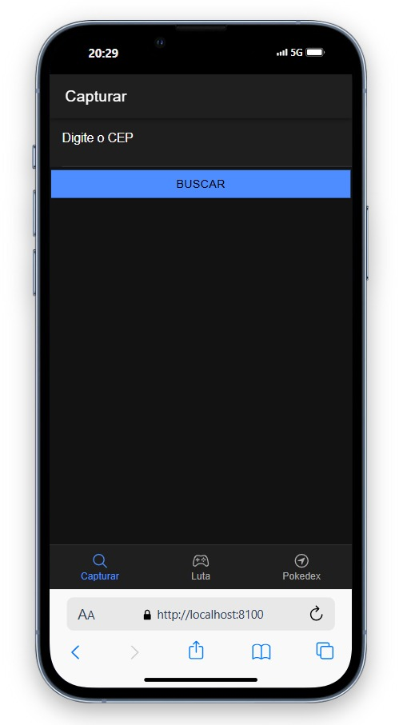
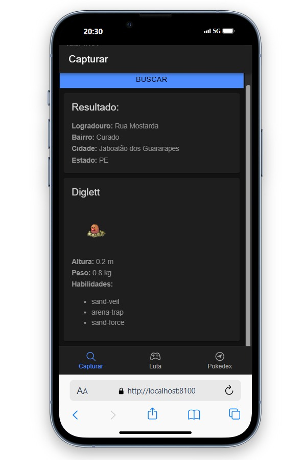
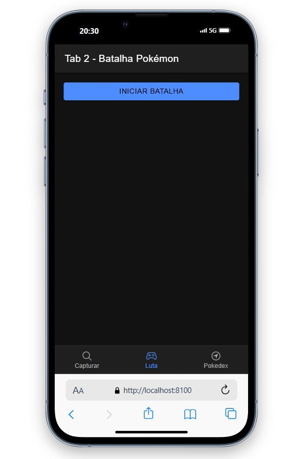
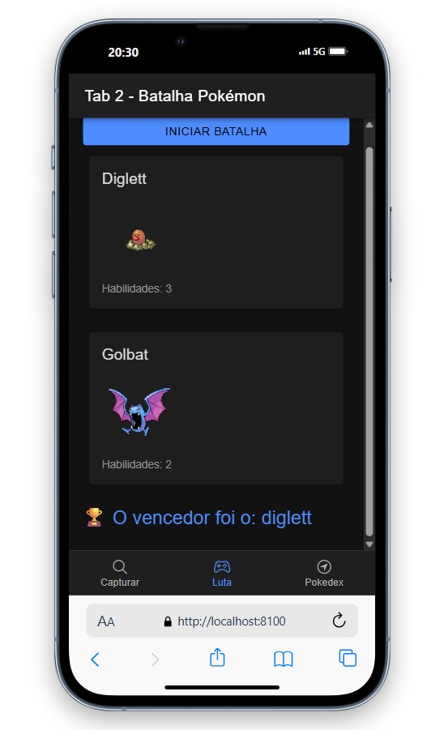
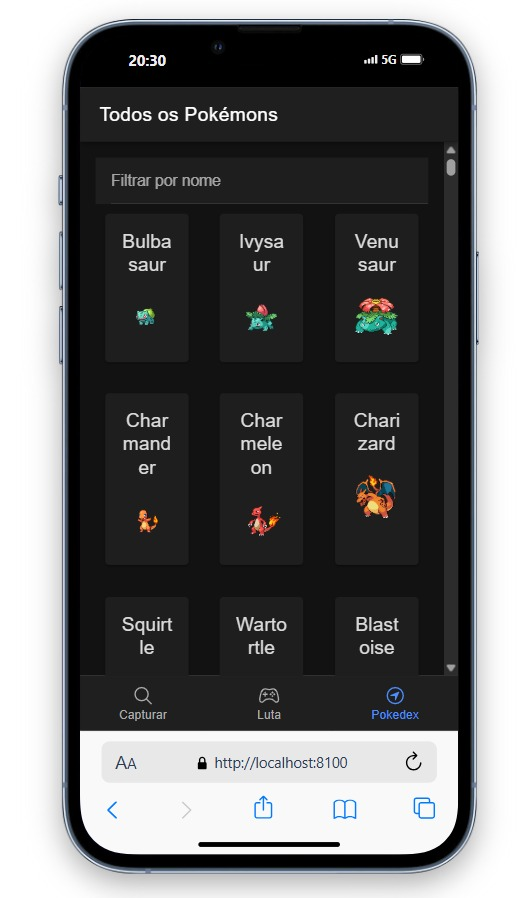

# 📱 Pokédex App com Ionic + Angular + PokeAPI

Este projeto é uma Pokédex interativa desenvolvida com **Ionic + Angular**, que consome a [PokeAPI](https://pokeapi.co/). Com ela, é possível:

- 🔍 Pesquisar Pokémons por nome
- 📦 Listar todos os Pokémons com paginação
- 🧭 Buscar um Pokémon pelo seu CEP
- ⚔️ Iniciar batalhas entre Pokémons

---

## 🚀 Como iniciar o projeto

1. Clone o repositório:
   ```bash
   git clone <REPO_URL>
   cd nome-do-projeto
   ```

2. Instale as dependências:
   ```bash
   npm install
   ```

3. Rode a aplicação com:
   ```bash
   ionic serve
   ```

---

## 🧭 Como usar a aplicação

### 1️⃣ Buscar Pokémon por CEP

Digite um CEP válido para encontrar um Pokémon associado à sua localização.



---

### 2️⃣ Ver resultado da busca

O Pokémon encontrado será exibido com seus dados: altura, peso e habilidades.



---

### 3️⃣ Ir para a aba "Luta"

A aba 2 permite iniciar batalhas Pokémon. O Pokémon encontrado no CEP enfrentará um Pokémon aleatório.



---

### 4️⃣ Ver o resultado da batalha

Após a batalha, o vencedor é exibido com base na quantidade de habilidades.



---

### 5️⃣ Visualizar toda a Pokédex

A aba 3 exibe todos os Pokémons da API com paginação (3x3). Você pode buscar pelo nome 🔍.



---

## 📦 Tecnologias

- Ionic
- Angular
- TypeScript
- PokeAPI

---

Feito com ❤️ por [João Albuquerque]